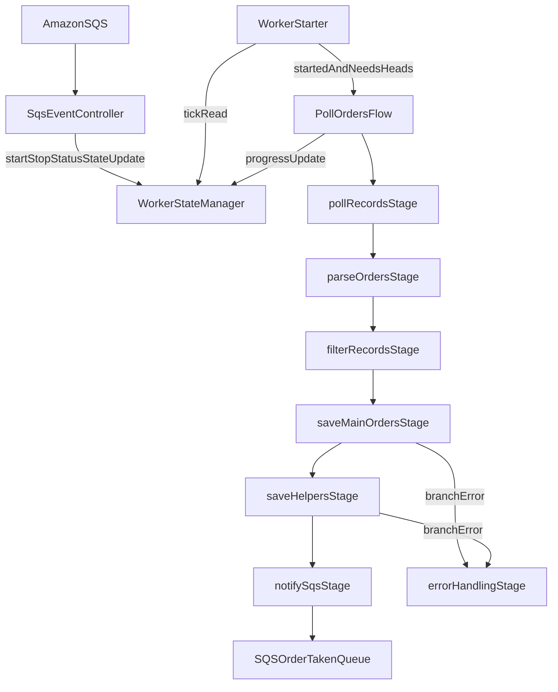

# Worker BRD: pollOrdersFlow

## Objective

Implement a worker business flow that receives start/stop/status commands from SQS, polls available orders, saves selected orders, and emits `OrderTaken` events with completion status.

## Event Contract

### Inbound Events (SqsEventController)

1. `StartEvent`
   - `String eventVersion`
   - `Instant producedAt`
   - `int headsToTake`
   - `List<OrderType> orderTypes`
2. `StopEvent`
3. `StatusEvent`

### Outbound Events

- `OrderTaken`
  - `String eventVersion`,
  - `Instant producedAt`,
  - list of saved orders,
  - `completed` flag (`true` when `headsTaken >= headsToTake`).

## Component Responsibilities

### SqsEventController

- Receives `StartEvent`, `StopEvent`, `StatusEvent` from Amazon SQS.
- On `StartEvent`:
  - validates payload,
  - updates `WorkerStateManager.started = true`,
  - stores run parameters (`headsToTake`, `orderTypes`).
- On `StopEvent`:
  - updates `WorkerStateManager.started = false`.
- On `StatusEvent`:
  - returns current state snapshot (started/progress/session metadata).

### WorkerStateManager

- Stores mutable flow session state:
  - `started`,
  - `headsToTake`,
  - `headsTaken`,
  - allowed `orderTypes`,
  - previously taken order identifiers (by `order.sid`),
  - session and telemetry markers.
- Main unique order key across flow stages and state deduplication is `order.sid`.

### WorkerStarter

- Runs infinite delayed ticks.
- On each tick:
  1. Read `WorkerStateManager.started`.
  2. If `false`, no flow subscription.
  3. If `true`, verify remaining capacity (`headsTaken` vs `headsToTake`).
  4. If more heads are needed, execute `PollOrdersFlow` in single-thread mode.
  5. Blocking rule: next tick starts only when current flow execution is finished.

## pollOrdersFlow Business Sequence

### 4.1 pollRecordsStage

- Calls combined URL endpoint with reactive WebClient.
- Fetches `List<Record>` payload from source API.
- Produces stage result containing raw records and retrieval metadata.
- WebClient must always include headers: `xApiToken`, `xStackId`.
- Observation rule for polling: do not attach full response body to span/events; add only `resultInfo.totalResults` as an observation tag.

### 4.2 parseOrdersStage

- Uses `OrderParsingUtil` to transform `Record` payloads into parsed orders.
- Preserves order typing using requested `orderTypes` from current session state.

### 4.3 filterRecordsStage

- Sorts main orders by heads descending (higher heads first).
- Selects minimum subset needed to reach `headsToTake`.
- Preference rule: choose larger-head order even if it overshoots target.
- Removes orders already taken in previous sessions/ticks.
- Produces filtered main orders and helper references.

### 4.4 saveMainOrdersStage

- Saves filtered main orders in parallel.
- Parallelism limit: `maxParallelOrdersToSaveThreads`.
- For each main order:
  - send PATCH to `airportalHost + saveArtistNamePath + artistSid`,
  - body includes main order sid to assign/save.
- WebClient must always include headers: `xApiToken`, `xStackId`.
- Updates `WorkerStateManager` for successfully saved main orders only.

### 4.5 saveHelpersStage

- Saves helper orders in parallel using the same thread limit strategy.
- Scope is restricted to helpers associated with filtered and successfully saved main orders.
- WebClient must always include headers: `xApiToken`, `xStackId`.
- Updates `WorkerStateManager` for successful helper saves.

### 4.6 notifySqsStage

- Sends `OrderTaken` event to SQS with:
  - saved orders,
  - `completed` computed as `headsTaken >= headsToTake`,
  - `eventVersion` and `producedAt` for contract evolution and traceability.
- Persists final per-tick progress into `WorkerStateManager`.

### 4.7 errorHandlingStage

- Centralizes flow error strategy.
- Maps technical failures to structured outcomes.
- Ensures stage-level errors are logged with session correlation markers.
- No retry logic: failed external operations are skipped after logging.

## Parallel Save Failure Policy

- In `saveMainOrdersStage` and `saveHelpersStage`:
  - failure in one parallel branch must not cancel other branches,
  - failed branches are logged with order id and error category,
  - flow continues and processes successful results,
  - failed items are skipped (no retry).
- Final `OrderTaken` event includes only successfully saved orders.

## State Transition Rules

- `StartEvent` switches state to active and sets flow targets.
- `StopEvent` switches state to inactive and prevents new flow ticks.
- Active state remains until explicit stop or completion logic is triggered by business rules.

## End-to-End Runtime View

## Non-Functional Constraints

- Use reactive non-blocking I/O for all network calls.
- Keep flow orchestration at composition level only.
- Keep business and integration logic in stages.
- Keep per-stage output explicit through `FlowContext` and `StageResult` contracts.
- No retry behavior for server errors in current version.
- Implement flow-specific context classes (for example, `PollOrdersFlowContext`) with explicit stage result fields.

## Runtime Configuration (`application.yml`)

- Base host and paths:
  - `order-hunter.airportalHost`: API host for polling and saving.
  - `order-hunter.saveArtistNamePath`: base PATCH path for assigning orders.
  - `order-hunter.freeOrdersPath`: query for normal/free order polling.
  - `order-hunter.priorityOrdersPath`: query for priority order polling.
  - `order-hunter.fastTrackOrdersPath`: query for fast-track order polling.
- Auth and tenancy headers:
  - `order-hunter.xApiToken`: value for `xApiToken` header (required on every WebClient request).
  - `order-hunter.xStackId`: value for `xStackId` header (required on every WebClient request).
- Queue and region:
  - `order-hunter.commandsQueue`: inbound command queue.
  - `order-hunter.eventsQueue`: outbound events queue.
  - `order-hunter.awsRegion`: AWS region for SQS client.
- Worker behavior:
  - `order-hunter.hunterId`: worker instance identifier.
  - `order-hunter.maxParallelOrdersToSaveThreads`: max parallel save branches.
  - `order-hunter.beforeOrderSavingJitterMax`: pre-save jitter upper bound.
  - `order-hunter.betweenPollsJitterMax`: inter-tick jitter upper bound.
  - `order-hunter.disableJitterRandomize`: disables random jitter when true.
  - `order-hunter.pollingTimeout`: polling HTTP timeout.
  - `order-hunter.savingTimeout`: saving HTTP timeout.
