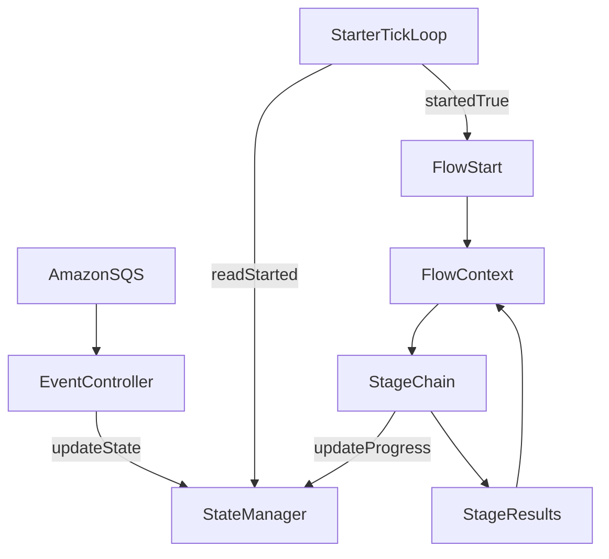

# Reactive Flow Architecture

## Purpose

This document describes the high-level reactive architecture used to run long-lived worker flows triggered by SQS events. The architecture separates transport, state, orchestration, and business stages so flow logic stays explicit and testable.

## Core Components

### 1) EventController

- Exposes server endpoints/listeners that receive external events from Amazon SQS.
- Converts transport payloads into application commands.
- Can update `StateManager` (for example, start or stop flags).
- Must not execute business flow logic directly.

### 2) StateManager

- Holds mutable worker state between flow sessions.
- Shared state can be updated by:
  - `EventController` (external commands),
  - flow stages (runtime progress and outcomes).
- Typical state fields include:
  - `started` marker,
  - target capacity (`headsToTake`),
  - progress (`headsTaken`),
  - deduplication memory for already processed orders.

### 3) Starters

- Runs an infinite reactive tick loop with configurable delay/jitter.
- For each tick:
  1. Read `StateManager.started`.
  2. If not started, skip current tick.
  3. If started, run one `Flow.start()` execution in single-thread mode.
  4. Start the next tick only after the previous flow run is fully finished (blocking loop semantics).
- Starter is the only component that periodically triggers flows.

### 4) Flow (`Flow.java`)

- High-level orchestration abstraction: `Mono<Void> start()`.
- Describes stage interactions with reactive composition (`flatMap`, `zip`, `onErrorResume`, and related operators).
- Flow-level code must only compose stages and pass `FlowContext`.
- Business logic is not allowed in flow body outside stage composition.
- Retry is not part of current logic: failed server calls are skipped and not retried.

### 5) FlowContext

- Per-session context propagated through all stages.
- Context type is flow-specific (for example, `PollOrdersFlowContext`), not a single global schema.
- Carries runtime metadata and stage outputs as explicit fields, for example:
  - `sessionId`,
  - log marker/correlation values,
  - `StageResult` artifacts from prior stages.

### 6) Stage (`Stage.java`)

- Main business execution unit: `Mono<Void> execute(ContextT context)`.
- A stage may:
  - call reactive WebClients,
  - read or update `StateManager`,
  - emit observations/logs,
  - apply centralized error mapping/skip policy.
- On server error, stage logic logs failure and skips failed item without retry.

### 7) StageResult (`StageResult.java`)

- Typed contract for artifacts produced by stages and consumed later in the same flow session.
- `stageType()` identifies producing stage to keep result ownership explicit.

## Reactive Rules

- Keep controllers thin; they only mutate state and acknowledge inbound events.
- Keep flow orchestration thin; only wire stages and reactive control flow.
- Keep business and integration logic inside stages.
- Avoid blocking calls inside controller/starter/flow/stage code paths.
- Prefer deterministic context propagation over hidden shared mutable state.
- For parallel stage execution, one branch failure must not abort remaining branches.
- For external server failures, skip failed items and continue flow without retry.

## Observation

- Use Micrometer Observation as the primary application-level observability API.
- Use `@Observed` or manual `Observation` blocks via `ObservationRegistry` for business boundaries.
- Do not use manual tracing APIs directly in application code.
- For WebFlux `WebClient` calls (`PATCH`, `POST`), add request and response JSON bodies into observation span logs/events.
- For SQS client interactions, create manual observation spans per method (or apply `@Observed` per method) to ensure queue operations are traced consistently.

## Event Envelope Recommendation

- Include `eventVersion` and `producedAt` in event contracts (at minimum for `StartEvent` and `OrderTaken`).
- Keep these fields mandatory to support schema evolution and traceability.

## Starter-Initiated Runtime Lifecycle

## Responsibilities Boundary

- `EventController`: transport input and state switching.
- `StateManager`: shared runtime state and progress memory.
- `Starter`: periodic trigger and single-thread flow subscription policy.
- `Flow`: declarative stage composition.
- `Stage`: all business logic and external interactions.
- `FlowContext`/`StageResult`: explicit data exchange contract between stages.
